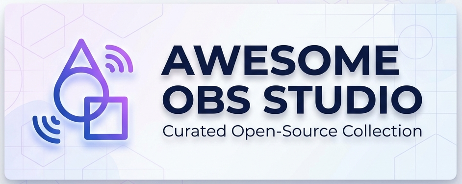

  

> A curated collection of **open-source** plugins, scripts, tools, and themes for OBS Studio.

This repository focuses **exclusively** on high-quality, open-source software related to OBS Studio.

## Contents

* [Plugins](#plugins)
* [Scripts](#scripts)
* [External Tools & Utilities](#external-tools--utilities)
* [OBS Themes](#obs-themes)
* [OBS Forks](#obs-forks)
* [Contributions](#contributions)
* [Contact](#contact)

---

## Plugins

### Streaming & Production

* [Multiple RTMP Outputs](https://github.com/sorayuki/obs-multi-rtmp) - Stream to multiple platforms simultaneously. 4.5k stars. Intermediate.

* [Aitum Vertical](https://github.com/aitum/obs-vertical-canvas) - Adds a vertical canvas (9:16) for Shorts/Reels. 228 stars. Beginner. Perfect for TikTok, YouTube Shorts, Instagram Reels.

* [Aitum Multistream](https://github.com/aitum/obs-aitum-multistream) - Integrated multi-platform streaming inside OBS. 169 stars. Beginner.

* [Advanced Scene Switcher](https://github.com/WarmUpTill/SceneSwitcher) - Rule-based automated scene switching. 1.3k stars. Advanced. Powerful automation tool for complex workflows.

* [Source Dock](https://github.com/exeldro/obs-source-dock) - Pop any source out into a movable dock. Beginner.

* [Downstream Keyer](https://github.com/exeldro/obs-downstream-keyer) - Add persistent overlays across all scenes. Intermediate. Great for consistent branding across scenes.

* [Directory Watch Media](https://github.com/exeldro/obs-dir-watch-media) - Auto-update media source based on folder contents. Intermediate.

* [Autostarter](https://github.com/DaviBe92/Autostarter) - Auto-launch programs when OBS starts. Beginner. Start chatbots, tools automatically with OBS.

* [SE.Live (StreamElements)](https://github.com/StreamElements/obs-streamelements-core) - Integrates Twitch/YouTube/Facebook chat, alerts, and activity feeds. Beginner. All-in-one streaming solution.

---

### Recording & Output

* [Source Record](https://github.com/exeldro/obs-source-record) - Record individual sources or scenes. Beginner. Record individual elements without affecting main stream.

* [Replay Source](https://github.com/exeldro/obs-replay-source) - Instant replay playback + buffer. Intermediate. Perfect for gaming and sports streams.

* [OBS WebSocket (Built-in)](https://github.com/obsproject/obs-websocket) - Remote control interface for OBS v28+. 4.2k stars. Advanced. Built-in since OBS 28.0 Essential for automation and remote control.

* [DistroAV (NDI)](https://github.com/DistroAV/DistroAV) - Send/receive high-quality video over IP using NDI protocol. Advanced. Network video transmission for multi-PC setups Essential for dual-PC streaming.

* [Win-Capture-Audio](https://github.com/bozbez/win-capture-audio) - Capture audio from specific applications. Beginner. Isolate audio from individual programs instead of entire system.

---

### Visual & Effects

* [Move Transition](https://github.com/exeldro/obs-move-transition) - Animated transitions for sources. 813 stars. Intermediate. Create smooth, animated scene transitions.

* [StreamFX](https://github.com/Vhonowslend/StreamFX-Public) - Advanced effects: 3D, blur, shaders, glow. 4.1k stars. Advanced. 🌟 Industry-standard effects plugin.

* [StreamFX FreeFX Fork](https://github.com/xoxfaby/obs-StreamFX) - Updated community fork. Advanced. Community-maintained alternative.

* [ShaderFilter](https://github.com/exeldro/obs-shaderfilter) - Apply GLSL/HLSL shader filters to any source. 629 stars. Advanced. Custom shader programming support.

* [3D Effect](https://github.com/exeldro/obs-3d-effect) - Adds 3D rotation and perspective effects. Intermediate. 🔲 Transform sources in 3D space.

* [Freeze Filter](https://github.com/exeldro/obs-freeze-filter) - Freeze any video source on demand. Beginner. ⏸️ Instant freeze frame effect.

* [Composite Blur](https://github.com/FiniteSingularity/obs-composite-blur) - High-performance blur with multiple algorithms (Gaussian, Box, Bokeh). Intermediate. Correct alpha channel handling prevents halos.

* [Background Removal](https://github.com/royshil/obs-backgroundremoval) - AI-powered virtual green screen using neural network segmentation. Intermediate. Remove backgrounds without physical green screen.

* [Input Overlay](https://github.com/univrsal/input-overlay) - Visualize keyboard, mouse, and gamepad inputs on stream. Intermediate. Essential for tutorials and speedrunning.

* [Spectralizer](https://github.com/univrsal/spectralizer) - Beautiful audio visualizer inside OBS. 611 stars. Beginner. **Archived** - Maintainer suggests "Waveform" as replacement.

* [Tuna](https://github.com/univrsal/tuna) - Real-time "Now Playing" music info from media players. Beginner. Supports Spotify, VLC, MPD, and more.

* [Face Tracker](https://github.com/norihiro/obs-face-tracker) - AI-powered face tracking for dynamic camera focus. Intermediate. Auto-crops and centers speaker using face detection.

---

### Audio

* [OBS-ASIO](https://github.com/Andersama/obs-asio) - Native ASIO driver support for OBS. Advanced. Low-latency audio for musicians.

---

### Captioning & Accessibility

* [LocalVocal](https://github.com/royshil/obs-localvocal) - Offline Whisper-based subtitles & translation. Advanced. Fully offline - no cloud required Supports multiple languages.

* [OBS Color Monitor (Scopes)](https://github.com/norihiro/obs-color-monitor) - Waveform, vectorscope, parade scopes. Intermediate. Professional color grading tools.

---

## Scripts

OBS supports both **Lua** and **Python** scripting.

---

### Lua Scripts

> [!NOTE]
> **Coming Soon:** This section will be updated with enhanced metadata including platform badges, difficulty levels, star counts, and additional curated Lua scripts!

* [Libre Macros](https://github.com/upgradeQ/OBS-Libre-Macros) - Macro engine for advanced automation.

* [Zoom to Mouse](https://github.com/BlankSourceCode/obs-zoom-to-mouse) - Automatically zooms display capture to follow mouse cursor. Beginner. Smooth interpolation for tutorials.

* [OBS Bounce](https://github.com/insin/obs-bounce) - Animate sources with DVD-logo style bouncing or physics throwing. Beginner. Physics simulation for fun layouts.

* [Auto Execute Commands](https://github.com/rse/obs-scripts) - Execute commands on OBS startup/shutdown. Beginner. Part of rse/obs-scripts collection.

---

### Python Scripts

* [Countdown Timer](https://github.com/micahmo/obs-countdown-python) - Countdown to specific date/time with customizable text. Beginner. Counts down to specific time, customizable expired text Requirements: Python 3.6+, python-dateutil, pyperclip.

* [Countdown Timer with Sound](https://github.com/KernFerm/countdown-timer-obs) - GUI countdown timer with sound alerts. Beginner. Pygame/Tkinter interface, import .mp3/.wav sounds, plays sound at specific time.

* [Now Playing (Linux)](https://github.com/shock59/now-playing) - Spotify/media player info for Linux with artwork. Displays song title, artist, and album artwork. Uses browser source (http://localhost:4640/). Advanced. Requirements: PyGObject, PyYAML, Tornado, websockets, playerctl.

* [Date Time](https://github.com/deadbraindev/obs-date-time) - Real-time date and time display. Beginner. Updates text sources with current timestamp.

* [Random Scene Switcher](https://github.com/deadbraindev/obs-scene-switcher) - Randomly switch between scenes. Random scene selection at intervals. Intermediate.

* [Random Text Generator](https://github.com/revenkroz/obs-random-text) - Display random text from lists. Beginner. Hotkey support, optional sound effects Simple animations available.

* [Sequence Sources](https://github.com/Prosperelucel/obs-scripts) - Cycle through sources with random mode. Intermediate. Sequential or random source display.

* [OBS WebSocket Python Client](https://github.com/Elektordi/obs-websocket-py) - Control OBS remotely via Python. Remote OBS control via WebSocket. Create custom automation tools. Works with OBS 28.0+ built-in WebSocket. Advanced.

---

## External Tools & Utilities

*(All open-source and compatible through OBS WebSocket.)*

* [Bitfocus Companion](https://github.com/bitfocus/companion) - Production automation + OBS control. Advanced. Stream Deck integration.

* [Kruiz Control](https://github.com/Kruiser8/Kruiz-Control) - Event-driven automation scripting for OBS. Intermediate. Great for Twitch integration.

* [OBS CLI](https://github.com/muesli/obs-cli) - Control OBS Studio from the terminal/automation scripts. Advanced. Command-line power users.

* [NohBoard](https://github.com/ThoNohT/NohBoard) - Standalone keyboard visualization tool. Beginner. Alternative to Input Overlay plugin.

* [OBS-Web](https://github.com/Niek/obs-web) - Browser-based remote control panel. Beginner. Touch-friendly control from mobile devices.

* [OBS Command](https://github.com/kalenmike/obs-cmd) - CLI tool for controlling OBS instances. Advanced. Rust-based command-line automation.

---

## OBS Themes

* [Twitchy Theme](https://obsproject.com/forum/resources/twitchy-obs-theme.1192/) - Twitch-inspired interface theme. Beginner. Purple aesthetic for Twitch streamers.

* [Catppuccin](https://github.com/catppuccin/obs) - Soothing pastel theme in Latte, Frappé, Macchiato, Mocha variants. Beginner. Part of popular Catppuccin design system.

* [Ocean Blue](https://obsproject.com/forum/resources/ocean-blue.1933/) - Modern dark theme with blue accents and clean unified look. Beginner. Brighter blue window bar, darker background.

* [Meloncholy](https://obsproject.com/forum/resources/meloncholy.1894/) - Vibrant light theme with custom icons. Beginner. Modern alternative to standard light themes. Updated March 2024.

---

## OBS Forks

Specialized distributions based on OBS Studio core:

* [Prism Live Studio](https://github.com/naver/prism-live-studio) - Feature-rich fork with beauty effects and built-in multistreaming. Intermediate. Consumer-focused with simplified interface.

---

## Contributions

We welcome community contributions! Help us keep this list awesome.

### How to Contribute

**Found a broken link or issue?**  
 [Report a Bug](https://github.com/Pralhad-Nasane/awesome-obs-collections/issues/new?template=bug_report.md)

**Want to add a new resource?**  
 [Suggest a Resource](https://github.com/Pralhad-Nasane/awesome-obs-collections/issues/new?template=feature_request.md)

**Ready to submit changes?**  
 [Create a Pull Request](https://github.com/Pralhad-Nasane/awesome-obs-collections/compare)

### Guidelines

Please ensure the resource:
* Is open-source (GitHub/GitLab)
* Is actively maintained or still useful
* Is high quality and relevant to OBS Studio
* Follows our format: `* [Name](url) - Description. Difficulty.`

 Read our full [Contributing Guidelines](contributing.md) for more details.

---

## Contact

Have questions or want to discuss OBS resources? Connect with me:

**Pralhad Nasane** - Feel free to reach out for discussions about OBS Studio, streaming, or this collection!

